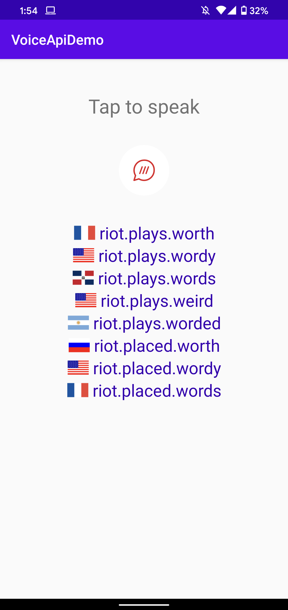

# Voice API Example



### Getting Started

The first steps to getting started are:

1. [Get your free API key](https://accounts.what3words.com/create-api-key).
2. Currently the Voice API is in beta, and therefore, access is granted upon request. Please contact us at voiceapi@what3words.com to **enable the Voice API** for your account.
3. Take a look at the [online documentation](https://developer.what3words.com/voice-api).
4. Replace YOUR_API_KEY_HERE placeholder on VoiceApi.kt

### Requirements

Android 5.0+,
Android Studio+ 

### Overview

This is a quick example using what3words' VoiceAPI.  It is a very minimal implementation to show how the basics work.  It is designed to provide illumnation on the API in advance of a full Android API wrapper being formally published.

##### class MainActivity

This heart of this very basic app is in `MainActivity` which contains a `VoiceApi` to use our VoiceApi with webSockets (okhttp3 used in this example) and uses `AudioRecord` to users record voice. It basically turns on the microphone and streams audio data to the VoiceApi when a button is tapped.

`MainActivity` implements the `VoiceApiListener` that will notify the activity when the socket have `connected`, when received `suggestions` and if an `error` happened.

When `suggestions` come back from `VoiceApi`, we populate a simple RecyclerView with the what3words address and the respective country flag (used https://www.countryflags.io/ for this example).

##### class VoiceApi

The `VoiceApi` class handles the what3words Voice API.  It uses a Okhttp3 WebSocket class to handle all the nuts and bolts of communication.

First you call `open(...)` with the audio parameters, and what3words options, then `send(data: ByteString)` is to be called with the audio bytes as it is available.

Finally, when three word addresses are recognized, it calls the `VoiceApiListener.suggestions` which will provide the view with an array of `VoiceSuggestion`.  

Details:

###### open()
```
open(sampleRate:Int, encoding:String = "pcm_s16le", language:String = "en", resultCount:Int? = null, focusLat:Double? = null, focusLong:Double? = null, focusCount:Int? = null, country:String? = null, circleCenterLat:Double? = null, circleCenterLong:Double? = null, cicleRadius:Double? = null)
```

This opens the socket to the server using a URL with a querystring containing all the desired `autosuggest()` parameters, and then it sends a handshake in the form of a JSON message containing paramters for the audio to come.

###### send()

```
send(data: ByteString)
```
This will send the audio data to the server.  This is called everytime new audio data is recieved from the microphone

##### VoiceApiListener

```
    /**
     * When WebSocket successfully does the handshake with VoiceAPI
     */
    connected()

    /**
     * When VoiceAPI receive the recording, processed it and retrieved what3word addresses
     */
    suggestions(suggestions: List<Suggestion>)

    /**
     * When there's an error with the VoiceAPI connection, please find all errors at: https://developer.what3words.com/voice-api/docs#error-handling
     */
     error(message: String)
```

### Example suggestions JSON

```
{
   "message":"Suggestions",
   "suggestions":[
      {
         "country":"GB",
         "nearestPlace":"Bayswater, London",
         "words":"filled.count.soap",
         "distanceToFocusKm":0,
         "rank":1,
         "language":"en"
      },
      {
         "country":"GR",
         "nearestPlace":"Týrnavos, Thessaly",
         "words":"filled.count.soaped",
         "distanceToFocusKm":0,
         "rank":2,
         "language":"en"
      },
      {
         "country":"US",
         "nearestPlace":"Fisher, Illinois",
         "words":"filled.count.snow",
         "distanceToFocusKm":0,
         "rank":3,
         "language":"en"
      },
      {
         "country":"US",
         "nearestPlace":"Lake Geneva, Wisconsin",
         "words":"filled.count.solo",
         "distanceToFocusKm":0,
         "rank":4,
         "language":"en"
      },
      {
         "country":"US",
         "nearestPlace":"Lents, Oregon",
         "words":"filled.counts.soap",
         "distanceToFocusKm":0,
         "rank":5,
         "language":"en"
      },
      {
         "country":"US",
         "nearestPlace":"Alturas, California",
         "words":"filled.count.soaked",
         "distanceToFocusKm":0,
         "rank":6,
         "language":"en"
      },
      {
         "country":"GB",
         "nearestPlace":"Whitefield, Bury",
         "words":"filled.count.soak",
         "distanceToFocusKm":0,
         "rank":7,
         "language":"en"
      },
      {
         "country":"US",
         "nearestPlace":"Upper Nyack, New York",
         "words":"filled.counts.hope",
         "distanceToFocusKm":0,
         "rank":8,
         "language":"en"
      }
   ]
}
```